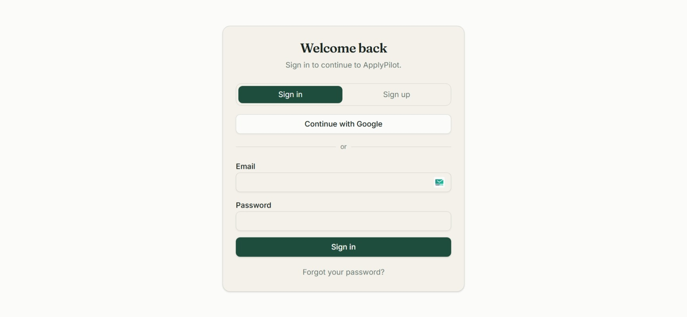
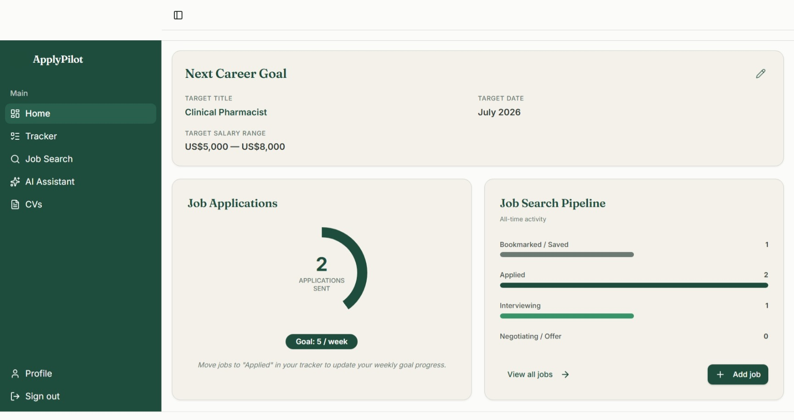
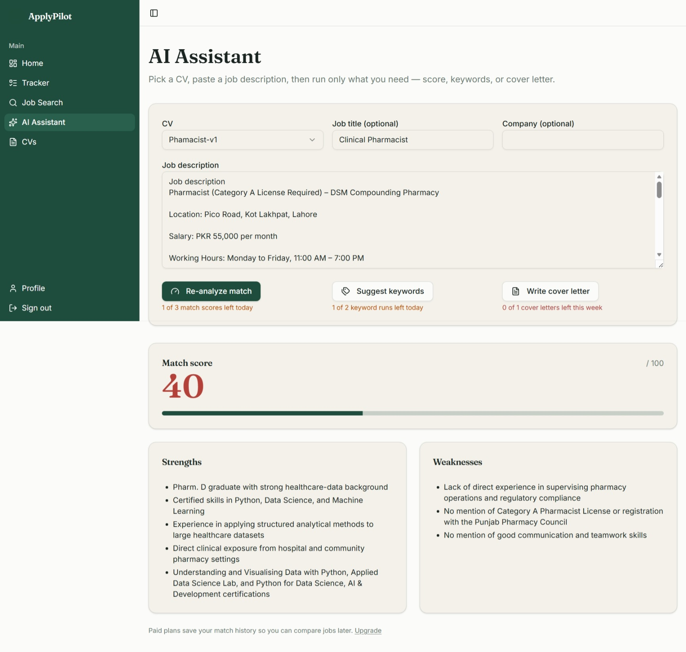
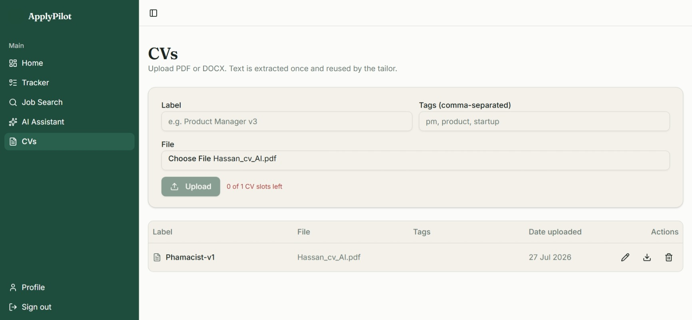
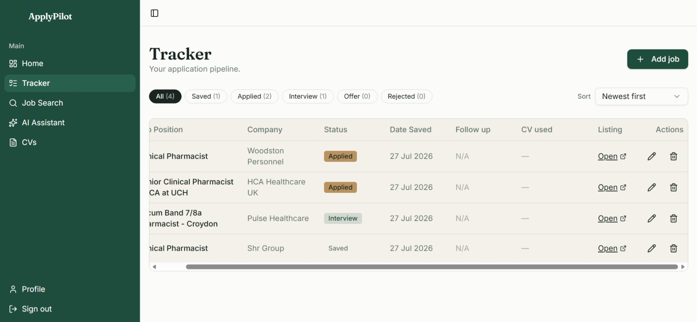
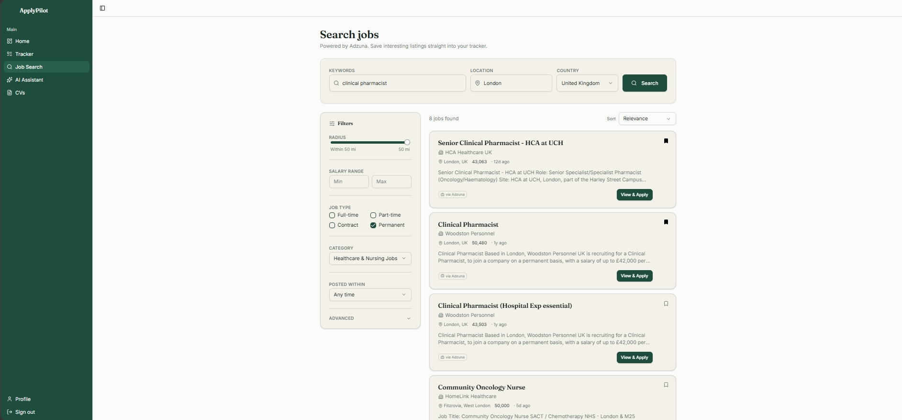

# ApplyPilot

**Live app:** [https://applypilot-plum.vercel.app](https://applypilot-plum.vercel.app)
**Repo:** [github.com/ZackFair-med/apply-buddy-54](https://github.com/ZackFair-med/apply-buddy-54)

## The problem

Job hunting for most professionals is scattered across browser tabs, WhatsApp notes, and a dozen versions of the same CV saved as "CV_final_v3_ACTUAL.pdf." Every application means re-reading a job description, guessing whether your CV is even a good fit, rewriting a cover letter from scratch, and then forgetting which company you already applied to.

ApplyPilot is a single place to store your CV(s), search live job listings, track every application through a pipeline (Saved → Applied → Interview → Offer → Rejected), and get an AI-generated fit score, keyword gaps, and a tailored cover letter for any job description you paste in — before you apply. It's built for anyone actively job-hunting, but the AI Tailor was designed with my own use case in mind: a Pharm.D graduate applying to clinical pharmacist roles.

## Features

- **Auth** — email/password and Google sign-in (Supabase Auth)
- **Dashboard** — target role, target salary range, target date, weekly application goal tracker, and an at-a-glance pipeline summary
- **CV vault** — upload multiple CV versions (PDF/DOCX) with labels and tags; text is extracted once on upload and reused for every AI call, so re-analyzing a job doesn't re-parse the file
- **Job Search** — search live listings by keyword, location, and country (powered by Adzuna), filter by salary range, job type, and category, and bookmark/save straight into your tracker
- **Tracker** — full application pipeline with status, company, position, date saved, follow-up date, which CV version was used, and a link back to the original listing
- **AI Assistant (AI Tailor)** — pick a CV, paste a job description, and run:
  - **Match score** (0–100) with a breakdown of strengths and weaknesses against the job description
  - **Keyword suggestions** — matched vs. missing keywords from the listing
  - **Cover letter generation** — a tailored draft based on the CV and job description
- **Usage limits** — free-tier daily/weekly caps on match scores, keyword runs, and cover letters (visible in the UI, e.g. "1 of 3 match scores left today")

## The AI feature

**Provider:** Groq Cloud API, model `llama-3.1-8b-instant`, called via `https://api.groq.com/openai/v1/chat/completions`.

The AI Tailor takes the extracted CV text, the pasted job description, and an optional job title/company, and builds a shared context block from them. Three independent calls run against that context depending on which button you press: match scoring, keyword extraction, and cover letter generation. The first two use Groq's JSON response mode so the output is parsed directly into the UI.

**System prompt — match score:**

```
You are scoring how well a candidate's CV matches a specific job description.

Score strictly against what THIS job description requires — do not give credit
for generic relevance. If a requirement (license, years of experience, a named
certification) is not clearly stated in the CV, treat it as missing, not assumed.

Return STRICT JSON only, no prose, no markdown fences:
{"matchScore": <integer 0-100>, "strengths": ["...", max 5], "weaknesses": ["...", max 5]}

Rules:
- Each strength must name something concrete in the CV and tie it to something
  the JD actually asks for.
- Each weakness must name something concrete the JD requires or prefers that
  the CV does not address.
- Do not invent or assume qualifications not present in the CV text.
```

**System prompt — keyword extraction:**

```
Compare the job description's required/preferred terms against the CV.

Return STRICT JSON only:
{"matchedKeywords": ["...", max 12], "missingKeywords": ["...", max 12]}

Rules:
- Prioritize hard requirements first: licenses/certifications, named tools,
  languages, frameworks, years of experience.
- Only include a term in matchedKeywords if it appears in the JD AND is
  clearly supported by the CV.
- Only include a term in missingKeywords if the JD requires or prefers it and
  the CV does not mention it.
- No duplicates, no generic filler ("team player", "communication skills")
  unless the JD names it as an explicit requirement.
```

**System prompt — cover letter:**

```
Write a tailored cover letter in first person, 320-380 words, plain text only
(no markdown, no placeholders like [Company Name]).
[+ an optional tone line: professional/respectful, warm/genuine/enthusiastic,
or confident/impactful/ownership-focused, depending on the tone the user picks]

Rules:
- Open by naming the actual role and company from the context.
- Ground every claim in the CANDIDATE CV text — never invent credentials,
  licenses, employers, or years of experience not present in the CV.
- Connect 2-3 specific CV details to specific requirements in the job
  description.
- End with a direct, confident closing line — skip "I look forward to
  hearing from you."
```

Each call sends this user-side context alongside the system prompt:

```
JOB TITLE: <jobTitle or "(unspecified)">
COMPANY: <company or "(unspecified)">

JOB DESCRIPTION:
<jobDescription>

CANDIDATE CV:
<cvText, truncated to 3000 characters for performance>
```

Results are clamped/sanitized in code after parsing (match score forced into 0–100, keyword and bullet lists capped at 5–12 items) so a malformed model response can't break the UI.

## Tools, services, and models used

| Purpose | Tool/Service |
|---|---|
| Frontend framework | React 19 + TanStack Start (Vite 7, SSR + server functions) |
| Language | TypeScript |
| Styling | Tailwind CSS v4 |
| Backend / DB / Auth / Storage | Supabase (Postgres, Auth, Storage) |
| AI provider | Groq Cloud API — Llama model |
| Job listings | Adzuna API |
| Hosting | Vercel |
| Initial scaffolding | Lovable (later exported to a standalone GitHub repo) |

## Screenshots

**Sign in**


**Dashboard — career goal, application count, pipeline summary**


**AI Assistant — match score, strengths, and weaknesses for a real job description**


**CV vault**


**Application tracker**


**Job search (Adzuna-powered)**


## How to run it locally

Requires [Bun](https://bun.sh).

```bash
git clone https://github.com/ZackFair-med/apply-buddy-54.git
cd apply-buddy-54
bun install
cp .env.example .env   # fill in the keys below
bun dev
```

Environment variables (`.env`):

```
VITE_SUPABASE_URL=...
VITE_SUPABASE_PUBLISHABLE_KEY=...
SUPABASE_URL=...
SUPABASE_PUBLISHABLE_KEY=...
AI_PROVIDER=groq
AI_API_KEY=...          # Groq API key
AI_MODEL=llama-3.1-8b-instant   # Groq model used in production
JOB_SEARCH_PROVIDER=adzuna
ADZUNA_APP_ID=...
ADZUNA_APP_KEY=...
```

No API keys are committed to the repo — all secrets are set as environment variables in Vercel for the live deployment.
